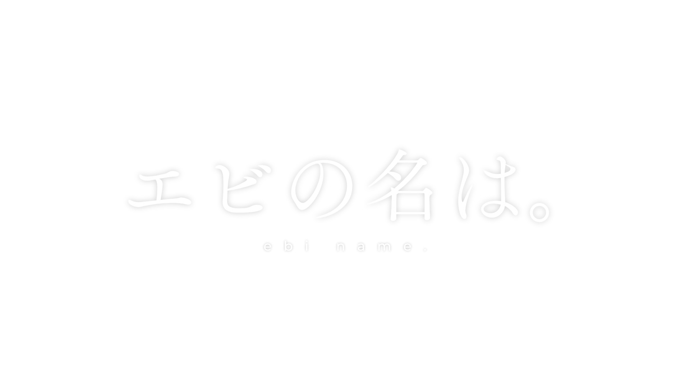

# ebiname

## 免責事項

[GitHubのヘルプ](https://help.github.com/ja/articles/about-github-actions)に

> また、次の目的ではGitHub Actionsを使用しないでください。  
> （中略）  
> 
> - サーバーレスコンピューティング  
> 
> （中略）  
> GitHub Actionsを不正利用した場合には、ジョブが停止されたり、GitHub Actionsの使用を制限されたりすることもあります。

とあります。

このリポジトリでの用途は思いっきりサーバーレスコンピューティングなので、これを使用したことによりアカウントのActionsの使用を制限されるなどしても、作者は一切の責任を負いません。

## LICENSE

MIT
